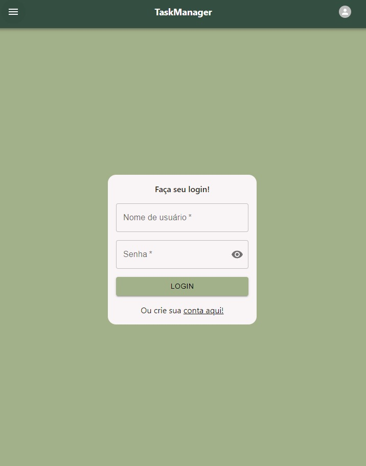

# TaskManager

TaskManager é um aplicativo de gerenciamento de tarefas desenvolvido em TypeScript, React, Vite, Express, Axios, MongoDB, Mongoose, Material UI e Tailwind. Este projeto tem como objetivo fornecer uma interface amigável para os usuários organizarem suas tarefas diárias de forma eficiente.

| :placard: Vitrine.Dev |     |
| -------------  | --- |
| :sparkles: Nome        | TaskManager
| :label: Tecnologias | TypeScript, React, Vite, Express, MongoDB
| :rocket: URL         | [https://url-deploy.com.br](https://todo-project-vite-3szg4dp7q-gabrielfgomss.vercel.app)

<!-- Inserir imagem com a #vitrinedev ao final do link -->


## Detalhes do projeto

Textos e imagens que descrevam seu projeto, suas conquistas, seus desafios, próximos passos, etc...

# TaskManager


## Descrição

TaskManager é um aplicativo de gerenciamento de tarefas desenvolvido em TypeScript, React, Vite, Express, Axios, MongoDB, Mongoose, Material UI e Tailwind. Este projeto tem como objetivo fornecer uma interface amigável para os usuários organizarem suas tarefas diárias de forma eficiente.

## 🚀 Funcionalidades

- ✏️ Adicionar tarefas
- ✅ Marcar tarefas como concluídas
- 🔍 Filtrar tarefas por status
- 👥 Gerenciamento de usuários com autenticação

## 💻 Tecnologias utilizadas

- TypeScript
- React
- Vite
- Express
- Axios
- MongoDB
- Mongoose
- Material UI
- Tailwind

## ⚙️ Instalação

1. Clone o repositório:
   ```bash
   git clone https://github.com/gabrielfgomss/TaskManager.git
   ```
2. Instale as dependências do frontend:
   cd TaskManager/frontend
   npm install
3. Instale as dependências do backend:
   cd ../backend
   npm install
4. Inicie o servidor de desenvolvimento:
   npm run dev
5. Abra o aplicativo no navegador:
   http://localhost:3000

👨‍💻 Autor
Desenvolvido por Gabriel Gomes Fernandes
